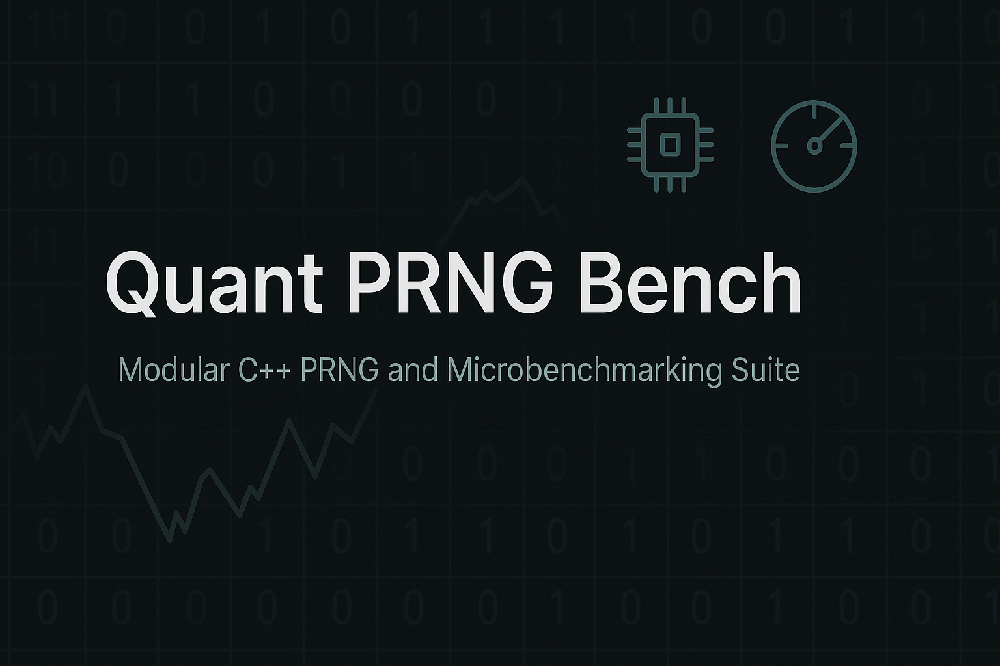

# Quant PRNG Bench

Modular C++ project featuring:

- 📦 `libprng`: Custom pseudorandom number generators (LCG, Xorshift, etc.)
- 🧪 `libbench`: Microbenchmark utilities using `chrono`
- 🧬 `test/`: Unit tests powered by GoogleTest + CTest
- 📊 `benchmarks/`: CLI tools to compare PRNG performance
- 🧠 Designed for reproducibility, modularity, and quant-oriented engineering

```bash
mkdir build && cd build
cmake ..
make
ctest      # Run all unit tests
